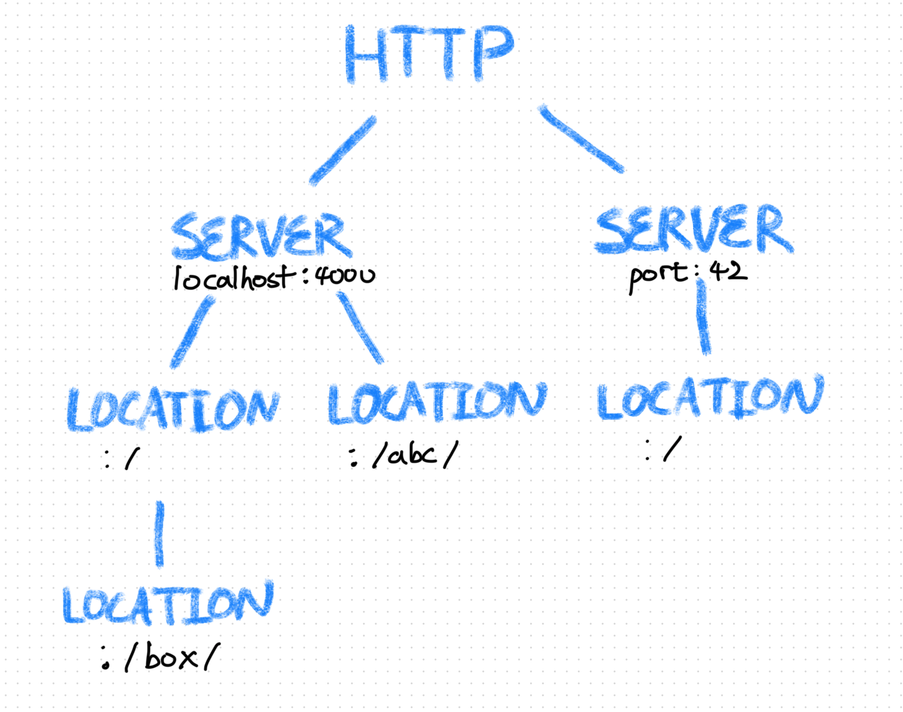
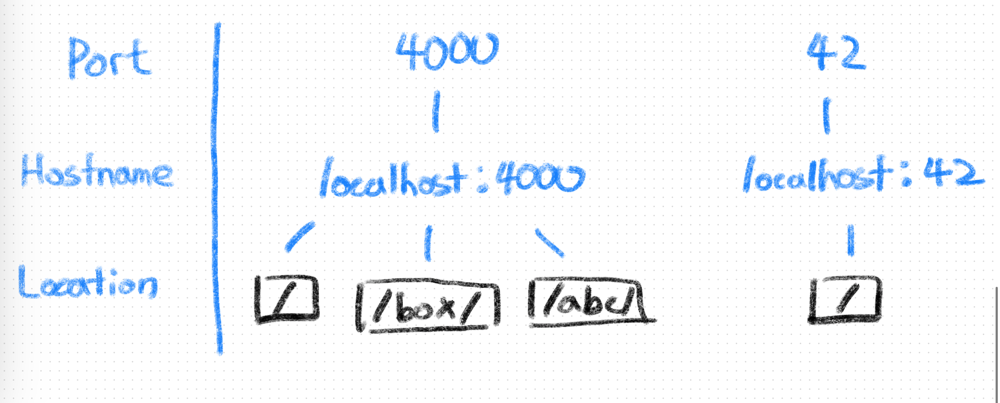

# README.md

# Webserv

**HTTP/1.1 compatible web server in C++ using I/O multiplexing.**

## Motivation and Considerations

Webserv is crafted as part of the challenging curriculum at School 42, focusing on developing a HTTP server in C++ 98. Key requirements include:

- Non-blocking socket read/write using `poll()`(or equivalent).
- Ensuring the server never hangs indefinitely.
- Ability to serve a fully static website.
- Support for GET, POST, and DELETE methods.
- Capability to listen to multiple ports.
These elements combine to create a robust, efficient web server.

## Technologies Used

- **Languages**: C++ 98, Makefile
- **Web Technologies**: HTML, CSS
- **Additional Tools**: Python
- **Programming Concepts**: Object Oriented Programming, Non-block I/O, I/O Multiplexing (kqueue), HTTP/1.1

## Implementation Details

### Architecture

### Configuration

```jsx
http {
	error_page 404 500 413 ./www/error/default.html;
	index index.html ;
	autoindex on;
	server {
		server_name localhost:4000;
		listen  4000;
		location / {
			alias ./www/example/;
			limit_except POST GET DELETE;
			
			location /box/ {
				limit_except GET;
			}
		}
		location /abc/ {
			alias ./www/example/;
		}
	}
	server {
		listen 42;
		client_max_body_size 100;
		location / {
			alias ./www/example/;
		}
	}
}
```

**A Bottom-up Approach**



In the initialization process, a web server parses the configuration in a tree shape. This allows each location configure to override specific settings like Nginx. Regex is partially implemented. (*, $)

This is implemented in `Config.{hpp, cpp}` less than 100 lines.

**A Top-down Approach**



After making the tree, the configuration is being mapped into `std::<map>`. This approach is to optimize the configuration access time of each HTTP request. The searching is processed in a several steps. 

1. Port
2. Hostname
3. Location

By using this method, the access time is reduced from $O(N)$ to $O(lg  N)$. 

This is implemented in `ConfigMap.{hpp, cpp}`

### Event Driven Architecture (I/O Multiplexing)

**Flowchart**



This is how this program flows. Server, client sockets and children’s PID are registered to kqueue. 



`class Server, Connection, CGI` inherits `class IEventHandler` which has `virtual void EventHandler()`. When an event is caught, it calls `EventHandler()` thus to call corresponding function in each class.

## Key Features

- **HTTP/1.1 Compliant**: Supports GET, POST, DELETE methods, along with features like HTTP pipelining and cookies.
- **Nginx-like Configuration**: Tree-shaped parsing for nested bracket `{}` configurations, resembling Nginx.
- **Efficient Configuration Access**: A sophisticated mapping system reduces access time from O(N) to O(log N).

## Challenges and Solutions

- **Class Destruction**: Implemented smart pointers for efficient connection management, adapting to C++ 98's limitations.
- **Forking and Multithreading**: Refined our approach to meet project requirements, gaining insights into process creation and management in Linux.
- **Parsing Complexity**: Developed efficient parsing strategies for both configuration files and HTTP requests, enhancing our problem-solving skills.
...

## Challenges and Solutions

**Class Destruction**

Every connection with a client has to be removed when the connection is lost. To resolve this problem we implemented smart pointer: sharedPtr since C++ 98 does not support smart pointer

`**Fork()**`

We did not notice the regulation about `fork()` and POSIX system calls in requirements. We wanted to make this program to support multiprocessing(multiple workers), and multithreading(thread pool). continuous configuration change like Nginx. So, we had to abandon the coolest code that we’ve ever written 😂.

Our program is single-processed except for CGI. Because of the event-driven structure, it was not easy to implement without using thread. But we could learn that `fork()`, `vfork()`, and `pthread_create()` are so similar to each other. They are using clone() in Linux and the difference among them is memory management and PID handling.

**Parsing**

Configuration

Parsing a configuration and checking syntax was challenging. We’ve set directive level flags (in Node.cpp) to make the code and logic as simple as possible.

HTTP request

Parsing an HTTP request from the socket’s output was quite hard too. We used Nekipelov’s httpparser and modified it to fit our usage. That helped us a lot. Thank you!

## Installation and Usage

Ensure you have a macOS environment and a C++ 98 compiler.

1. Clone the repository: `git clone [repository link]`
2. Compile the project: `make re` at the root directory.
3. Run the server: `./webserv configs/example.conf`


## Results and Discussion

This project was a deep dive into web server mechanics, leveraging C++ with OOP and I/O multiplexing. Our journey was marked by constant problem-solving and code refinement, enhancing our collaboration and communication skills. Despite some initial challenges, the final product is a testament to our perseverance and commitment to learning.

## Acknowledgements

**Nginx**

[GitHub - nginx/nginx](https://github.com/nginx/nginx)

**RFC 2616**

[RFC 2616: Hypertext Transfer Protocol -- HTTP/1.1](https://datatracker.ietf.org/doc/html/rfc2616)

**HTTP Parser**

[GitHub - nekipelov/httpparser: HTTP request, response and urls parser](https://github.com/nekipelov/httpparser)

**Kernel Queue**

[Kernel Queue: The Complete Guide On The Most Essential Technology For High-Performance I/O](https://habr.com/en/articles/600123/)

## License

MIT License
